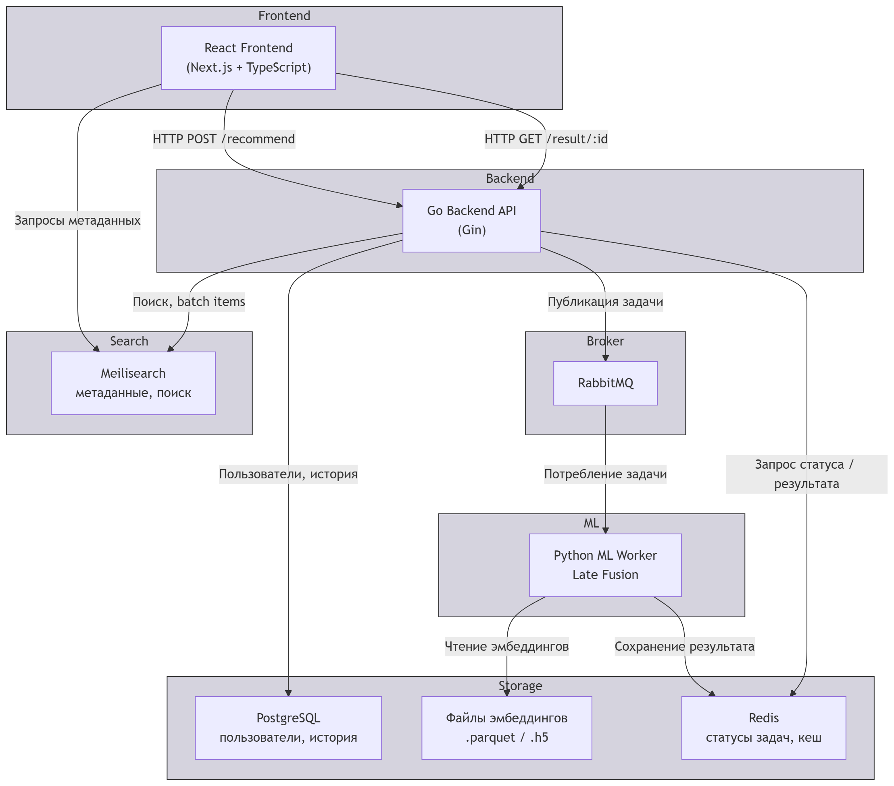

# Recly — Cross‑media Recommendation System

Recly — это кросс-медийная рекомендательная система, которая рекомендует фильмы на основе любимых книг пользователя и наоборот, а также выдаёт внутридоменные рекомендации. Система использует мультимодальный подход, объединяя текстовые описания, жанровые метки и визуальные признаки (изображения обложек и постеров) для построения эмбеддингов элементов каталога. Рекомендации вычисляются через позднее слияние (Late Fusion) трёх модальностей с оптимальными весами, подобранными экспериментально.

Проект реализован в виде микросервисного веб-приложения с Go-бэкендом, Python-воркером для ML-вычислений, поисковым движком Meilisearch, очередью RabbitMQ и адаптивным фронтендом на Next.js. Все компоненты контейнеризированы и управляются через Docker Compose.

## Технологический стек
| Компонент | Технологии |
|-----------------|------------|
| **Backend API** | Go (Gin, JWT, PostgreSQL, Redis, RabbitMQ, Meilisearch, zap) |
| **ML‑воркер** | Python (PyTorch, NumPy, pandas, h5py, scikit‑learn) |
| **Frontend** | Next.js (React, TypeScript, Tailwind CSS, React Query) |
| **Контейнеризация** | Docker, Docker Compose |

## Архитектура
Система состоит из микросервисов:
- `frontend` — клиентское приложение Next.js.
- `go-api` — REST API на Go (аутентификация, библиотека, рекомендации, поиск).
- `ml-worker` — Python‑воркер, подписанный на RabbitMQ, вычисляет рекомендации асинхронно.
- `meilisearch` — поисковый движок и batch‑запросы метаданных.
- `postgres` — реляционная БД для пользователей, их библиотеки и истории.
- `redis` — кэш статусов задач.
- `rabbitmq` — очередь сообщений для асинхронной обработки.



## Установка и запуск
### Требования
- Docker и Docker Compose
- Git
### Шаги
1. Клонируйте репозиторий:
```bash
git clone https://github.com/I000000/Recly.git
cd Recly
```
2.  Скопируйте файл с переменными окружения и заполните его:
```bash
cp .env.example .env
# Отредактируйте .env, укажите свои пароли и ключи
```
3. Скачайте предварительно вычисленные данные

Система использует заранее подготовленные мультимодальные эмбеддинги и Parquet-файлы с каталогом книг и фильмов. Доступны наборы данных на [10 тыс.](https://huggingface.co/datasets/asdsadsdaa/recly_10k), [20 тыс.](https://huggingface.co/datasets/asdsadsdaa/recly_20k),  [50 тыс.](https://huggingface.co/datasets/asdsadsdaa/recly_50k) или [100 тыс.](https://huggingface.co/datasets/asdsadsdaa/recly_100k) записей.

Скачайте архив любого из датасетов и распакуйте его в папку `data/` в корне проекта:
```bash
# Пример для 10k
wget -O data.tar.gz https://huggingface.co/datasets/asdsadsdaa/recly_10k/resolve/main/data.tar.gz
tar -xzf data.tar.gz -C data/
```
Если у вас нет `wget`, просто скачайте архив вручную и распакуйте в папку `data/`.

Убедитесь, что в файле `.env` указаны правильные пути к этим файлам (по умолчанию они уже настроены для 10k, измените при необходимости).

4. Запустите все сервисы (первый запуск требует индексацию)
```bash
docker compose --profile manual up -d
```
5. Остановить и запустить контейнеры в будущем можно так
```bash
docker compose down
docker compose up -d
```
6. Откройте приложение
-   Фронтенд: [http://localhost:3000](http://localhost:3000/)
-   Swagger API: [http://localhost:8080/swagger/index.html](http://localhost:8080/swagger/index.html)


## Основные эндпоинты API

| Метод | Путь | Описание |
|-------|------|----------|
| `POST` | `/api/auth/register` | Регистрация |
| `POST` | `/api/auth/login` | Вход |
| `POST` | `/api/book/:id/like` | Добавить книгу в библиотеку |
| `POST` | `/api/movie/:id/like` | Добавить фильм в библиотеку |
| `GET` | `/api/search` | Поиск |
| `POST` | `/api/recommend` | Запрос рекомендаций |
| `GET` | `/api/result/:taskId` | Получение результата |

Полная документация доступна через Swagger.

## Тестирование

Юнит-тесты:
```bash
cd backend
go test -v ./...
```
Интеграционные тесты (требуют Docker):
```bash
go test -v -tags=integration ./internal/repository/postgres/...
```